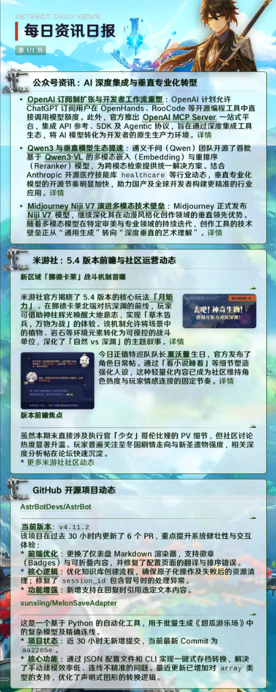

# AI日报插件 - React多Agent架构版

## 🎯 功能概述

这是一个基于AstrBot的AI日报插件，采用React多Agent架构，实现每日自动新闻汇总功能。加入QQ群：1054962131交流反馈

### ✨ 核心特性

- **React多Agent架构**: 基于ReAct范式的智能编排系统，支持多子Agent协作
- **多信息源支持**: 微信公众号、米游社、Twitter、AstrBook、GitHub、Grok搜索、Tavily搜索等
- **智能图像处理**: 自动图像标注与布局优化
- **自动日报**: 定时生成并发送日报
- **灵活配置**: 支持自定义新闻源和调度时间
- **美观渲染**: 基于模板的高质量日报输出
- **🚀 零依赖部署**: 无需安装Playwright等浏览器组件，大幅简化部署流程

效果展示：

### 信息源Agent

| Agent | 功能 |
|-------|------|
| wechat_agent | 微信公众号文章采集 |
| miyoushe_agent | 米游社帖子获取 |
| twitter_agent | Twitter信息抓取 |
| astrbook_agent | AstrBook内容获取 |
| github_agent | GitHub动态追踪 |
| xiuxiu_ai_agent | 秀秀AI内容获取 |

## 📰 信息源推荐

科技类

- https://mp.weixin.qq.com/s/QAVCOnnA5M8olmy7peBqsQ *每日AI日报*

### 🔍 搜索增强插件（推荐安装）

为获得更好的信息搜索体验，建议安装以下插件：

| 插件 | 功能 | 链接 |
|------|------|------|
| astrbot_plugin_grok_web_search | Grok网络搜索 | [GitHub](https://github.com/piexian/astrbot_plugin_grok_web_search) |

> 💡 **特别致谢**: 感谢 **@piexian** 开发的Grok搜索插件，为本项目提供了强大的网络搜索能力支持！

## 🚀 使用指南

### 基本命令

| 命令                      | 描述                                                                    |
| ------------------------- | ----------------------------------------------------------------------- |
| `/daily_news`             | 手动生成日报                                                            |
| `/news_config`            | 查看当前配置                                                            |
| `/news_toggle`            | 切换自动日报开关                                                        |
| `/news_add_source URL`    | 添加新闻源（默认添加到公众号列表；建议直接在面板分别配置公众号/米游社） |
| `/news_remove_source URL` | 删除新闻源（从公众号列表移除）                                          |
| `/news_config_help`       | 显示配置帮助                                                            |

## 🔍 调试和故障排除

### 常见问题

1. **日报生成失败**
   - 检查网络连接
   - 验证新闻源URL有效性
   - 查看插件日志获取详细错误信息

2. **定时任务不执行**
   - 确认插件已启用
   - 检查配置文件格式
   - 验证系统时间设置

### 日志查看

插件会在运行时输出详细日志，可以通过AstrBot的日志系统查看调试信息。

## 🤝 贡献指南

欢迎提交Issue和Pull Request来改进插件功能。

### 开发环境

1. 安装依赖: `pip install -r requirements.txt`
2. 配置开发环境
3. 运行测试

### 提交规范

- 遵循现有代码风格
- 添加必要的注释和文档
- 测试所有功能变更
- 更新相关文档

📝 更新日志

### v1.0.0
- 🎉 **重大更新**: 移除Playwright依赖，实现零浏览器组件部署
- 实现React多Agent架构
- 新增多信息源搜索平台支持（Grok、Tavily）
- 重构微信公众号数据采集逻辑
- 优化米游社数据提取模块
- 新增图像处理工具(image_tools)
- 优化渲染模板和配置系统

## 📄 许可证

MIT License - 详见LICENSE文件
